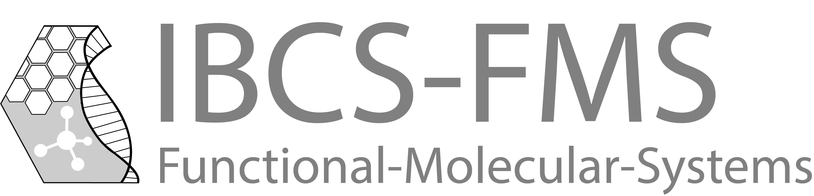

[section name="logo"]

[/section]

[section name="institute"]
Institute of Biological and Chemical Systems – Functional Molecular Systems (KIT)
[/section]
 
[section name="description"]
IBCS-Functional Molecular Systems is an interdisciplinary institute combining fundamental research in Biology and Chemistry. The aim of the institute is the improvement of the understanding of biological processes (e.g. cellular communication or disease progression) using advanced materials and chemical processes. The working groups focus on developing new smart materials, miniaturized high content screening methods as well as the design of novel biomedical tools for the treatment of diseases. The institute hosts the infrastructure Compound Platform including activities in cheminformatics and the development of scientific infrastructure.
[/section] 

[section name="website"]
[IBCS-FMS](https://fms.ibcs.kit.edu/)
[/section]

[section name="contact"]
[Nicole Jung](https://www.ioc.kit.edu/braese/21_110.php)
[/section] 
