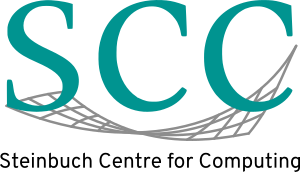

[section name="logo"]

[/section]

[section name="institute"]
Steibuch Centre for Computing (KIT)
[/section]
 
[section name="description"]
The Steinbuch Center for Computing (SCC) is the center for information technology of KIT and conducts its own research in addition to the tasks specific to an IT service center. The SCC plays a leading role in the fields of Large Scale Data Management & Analysis (LSDMA).
[/section] 

[section name="website"]
[Steinbuch Centre for Computing](http://scc.kit.edu)
[/section]

[section name="contact"]
Peter Krauß | [safe-email autolink="true" icon="envelope-o"]peter.krauss@kit.edu[/safe-email]
[/section] 
