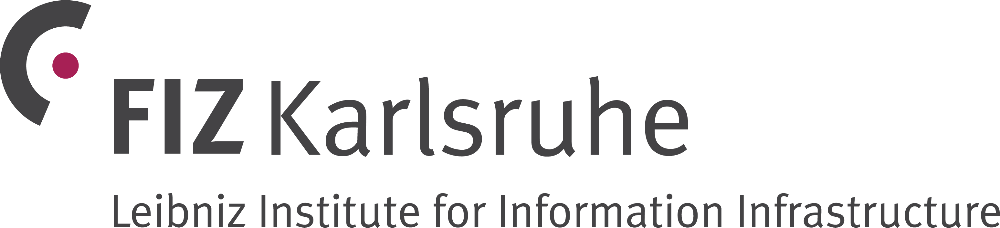

[section name="logo"]

[/section]

[section name="institute"]
FIZ Karlsruhe – Leibniz Institute for Information Infrastructure
[/section]
 
[section name="description"]
description [lorem w=35] 
[/section] 

[section name="website"]
[FIZ Karlsruhe](https://www.fiz-karlsruhe.de/en)
[/section]

[section name="contact"]
[Thomas Hartmann](https://www.fiz-karlsruhe.de/en/forschung/lebenslauf-und-publikationen-thomas-hartmann)
[/section] 
