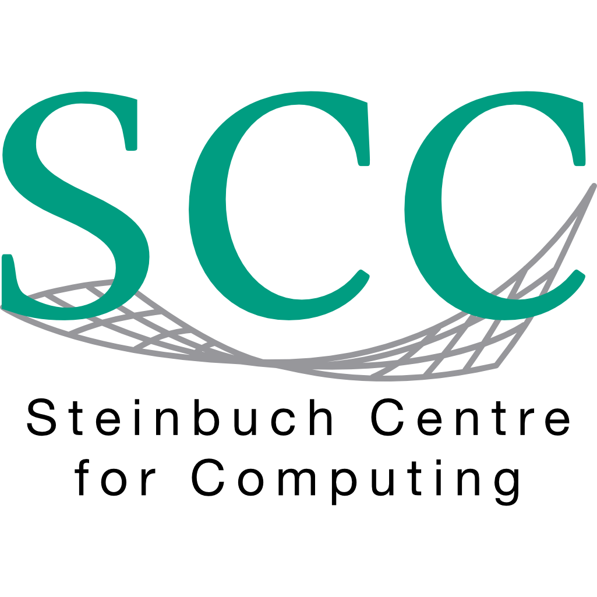

# Project-Partner

*This page is a work in progress. (DT)*

| [Stefan Bräse](https://www.ioc.kit.edu/braese/english/24.php) | [Britta Nestler](https://www.iam.kit.edu/cms/english/Mitarbeiter_nestler.php) | 
| -- | -- |
| Stefan Bräse is director of the Institute of Biological and Chemical Systems - Functional Molecular Systems (IBCS-FMS) and full professor at Institute of Organic Chemistry (IOC). | Textschnipsel |

***

| Logo | Institute | Description | Contact |
| -- | -- | -- | -- |
|  | [IBCS-Functional Molecular Systems](https://fms.ibcs.kit.edu/) | IBCS-Functional Molecular Systems is an interdisciplinary institute combining fundamental research in Biology and Chemistry. The aim of the institute is the improvement of the understanding of biological processes (e.g. cellular communication or disease progression) using advanced materials and chemical processes. The working groups focus on developing new smart materials, miniaturized high content screening methods as well as the design of novel biomedical tools for the treatment of diseases. The institute hosts the infrastructure Compound Platform including activities in cheminformatics and the development of scientific infrastructure. | [Nicole Jung](https://www.ioc.kit.edu/braese/english/21_110.php)  
|
| | [Institute for Applied Materials - Computational Materials Science](https://www.iam.kit.edu/cms/english/index.php) | Textschnipsel | [Michael Selzer](https://www.iam.kit.edu/cms/english/Mitarbeiter_selzer.php) 
|
| | [Steinbuch Centre for Computing](https://www.scc.kit.edu/en/index.php) | The Steinbuch Center for Computing (SCC) is the center for information technology of KIT and conducts its own research in addition to the tasks specific to an IT service center. The SCC plays a leading role in the fields of Large Scale Data Management & Analysis (LSDMA). | [Felix Bach](https://www.scc.kit.edu/en/staff/felix.bach.php) 
|
| | [Institute of Applied Informatics and Formal Description Methods](https://www.aifb.kit.edu/web/Hauptseite/en) | Textschnipsel | [Gunther Schiefer](https://www.aifb.kit.edu/web/Gunther_Schiefer/en) 
|
| | [KIT Library](https://www.bibliothek.kit.edu/cms/english/index.php)  | The KIT library is responsible for quality assurance in connection with the publication and reuse of research data and metadata. | [Dzulia Terzijska](https://www.bibliothek.kit.edu/cms/mitarbeiter_2768.php) 
|
|  |  | Textschnipsel |  |
|   |  | Textschnipsel |  |   
  
  
Sponsored by:  

